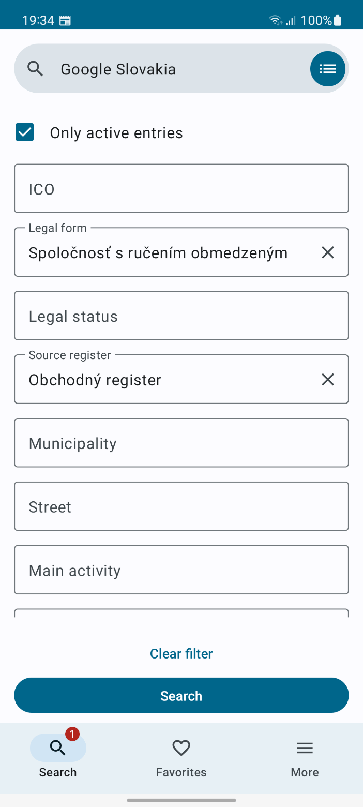
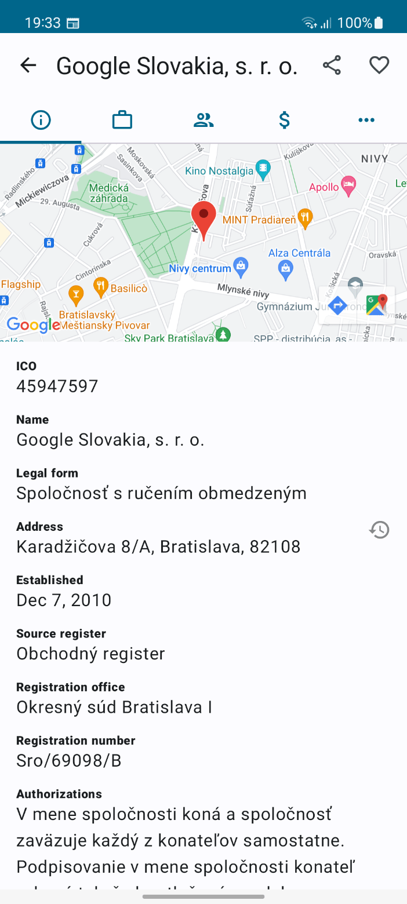

Firmy - Android application
==================

*Search for legal persons, businesses and public authorities in Slovak republic 🇸🇰.*

Application utilizes official national APIs for listing entities.

#### Screenshots

 

#### Architecture highlights

- UI & Navigation: *Compose and Navigation compose, Material 3 design*
- Dependency injection: *Hilt*
- Storage: *Room database*
- Network: *Ktor, Kotlinx serialization*
- Logging: *Timber*
- Other: *Crashlytics*

#### Data sources / API

- [https://susrrpo.docs.apiary.io/](https://susrrpo.docs.apiary.io/)
- [https://registeruz.sk/cruz-public/home/api](https://registeruz.sk/cruz-public/home/api)

#### License

- **Firmy** is distributed under the terms of the Apache License (Version 2.0). See the [license](LICENSE) for more information.
